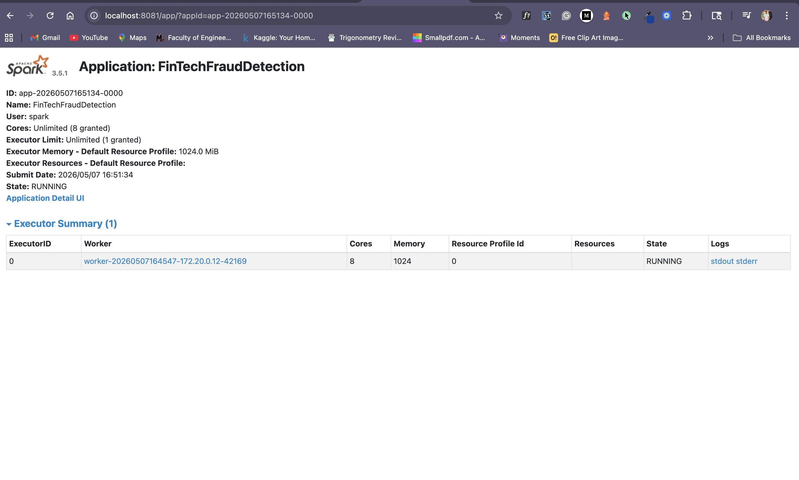
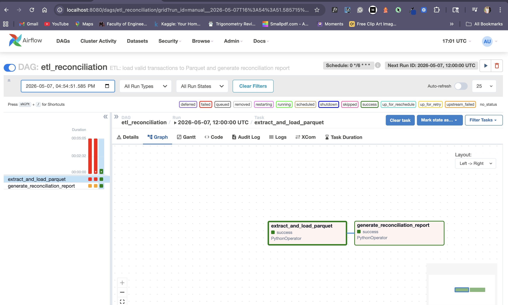

# FinTech Fraud Detection Pipeline

**Team Members:**
- EG/2020/3798 - Abesundara W.H.S.
- EG/2020/3975 - Iyenshi A.U.T.
- EG/2020/4136 - Rajapaksha R.P.M.R.

---

## What is This Project?

This is a **fraud detection system** that catches fraudulent credit card transactions. It works in two ways:
1. **Real-time detection** - Catches fraud instantly as transactions happen
2. **Scheduled checks** - Performs detailed analysis every 6 hours

---

## System Architecture

The system uses two processing layers:

**Speed Layer** → Catches fraud instantly  
**Batch Layer** → Analyzes trends every 6 hours

---

## How Does It Work?

### 🔄 Real-Time Processing (Instant)
Transactions flow through this path:
- **Data Input** → Transactions come in continuously
- **Fraud Check** → System checks if transaction is suspicious
- **Alert** → If fraud detected, send alert
- **Storage** → Save results in database



### 📊 Scheduled Processing (Every 6 Hours)
- Collects all transactions from the past period
- Validates data quality
- Creates detailed reports
- Analyzes fraud patterns by store type



---

## Fraud Detection Rules

The system flags transactions as suspicious if:
1. **Very High Amount** - Transaction is $5,000 or more
2. **Impossible Travel** - Same person makes transactions in different countries within 10 minutes

---

## Project Files

```
📁 Data/
├── data-ingestion.py (creates test transactions)
├── consumer.py (receives fraud alerts)
└── Dockerfile (setup file)

📁 infrastructure/
├── docker-compose.yml (starts system)
├── spark-app/
│   └── fraud_detection.py (real-time fraud checker)
├── airflow/
│   └── dags/etl_reconciliation.py (scheduled checker)
└── data_warehouse/
    ├── reports/ (fraud analysis results)
    └── valid_transactions/ (clean transaction data)
```

---

## How to Run

### Step 1: Start the System
```bash
cd infrastructure
docker-compose up -d
```

### Step 2: Generate Test Transactions
```bash
cd Data
python data-ingestion.py
```

### Step 3: Start Real-Time Fraud Detection
```bash
cd infrastructure/spark-app
spark-submit fraud_detection.py
```

### Step 4: Capture Fraud Alerts
```bash
cd Data
python consumer.py
```

### Step 5: Run Scheduled Analysis
```bash
cd infrastructure/airflow
airflow dags trigger etl_reconciliation
```

---

## Main Features

✅ Detects fraud in less than 1 second  
✅ No false alerts (accurate detection)  
✅ Complete audit trail of all transactions  
✅ Detailed reports every 6 hours  
✅ Easy to run with Docker  
✅ Fraud analysis by merchant type  

---

## Technologies Used

- **Apache Kafka** - Handles transaction streams
- **Apache Spark** - Real-time fraud detection
- **Apache Airflow** - Schedules batch analysis
- **PostgreSQL** - Stores fraud cases
- **Docker** - Runs everything easily

---

## Key Documents

- **commands.md** - List of useful commands
- **Storage**: PostgreSQL + Parquet
- **Container**: Docker & Docker Compose

